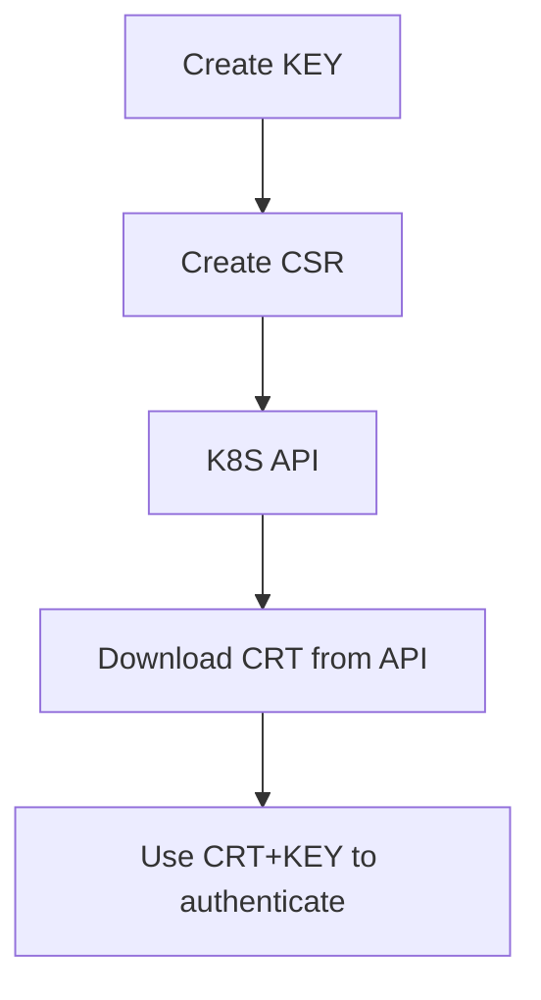

# Tips for the CKS Exam

> [Handbook](https://docs.linuxfoundation.org/tc-docs/certification/lf-handbook2) and [Important instructions](https://docs.linuxfoundation.org/tc-docs/certification/important-instructions-cks)

I saw everyone talking about the CKS exam being way harder than the CKA and CKAD, so, because of that, I will spend more time on hands-on labs, following some tips provided by [@mischavandenburg](https://github.com/mischavandenburg) in his youtube video: [CKS Study Guide 2024](https://www.youtube.com/watch?v=_l232KiJHNA), which would be:

- [CKS - Killer Shell Course on youtube](https://www.youtube.com/watch?v=d9xfB5qaOfg)
- [Killer Shell CKS Simulators (also RBAC and Network policies from others)](https://killercoda.com/)
- [killer.sh](https://killer.sh/cks)
zettelkasten.mischavanderburg.net

Additionally, almost the same tips from CKA and CKAD too:

- Get confortable with `kubectl`, use aliases if needed (but don't be obsessed about it, personally I used only `k` for `kubectl`).
- You're not alone in the exam, you can use the browser within the VM to access the Kubernetes documentation: https://kubernetes.io/docs/ or https://kubernetes.io/blog.
- Review your work, always double check your answers.
- Make sure to copy and paste the names correctly from the question, it's easy to make mistakes.
- Manage your time effectively, don't spend too much time on a single question, you don't have to get everything right to pass the exam.

## Resources allowed during the exam

During the exam, candidates may:

- Use the browser within the VM to access the following documentation:
  - Kubernetes Documentation: https://kubernetes.io/docs/
  - Kubernetes Blog: https://kubernetes.io/blog/
  - Falco documentation: https://falco.org/docs/
  - Bom documentation https://kubernetes-sigs.github.io/bom/cli-reference/ 
  - etcd documentation https://etcd.io/docs/
  - NGINX Ingress Controller Documentation https://kubernetes.github.io/ingress-nginx/user-guide/nginx-configuration/
  - Cilium Documentation https://docs.cilium.io/en/stable
  - Istio Documentation https://istio.io/latest/docs/
  - Task-specific documentation provided in the Quick Reference box. This may include links to the official Kubernetes documentation or other resources that might be needed to solve a task
- Review the Exam content instructions that are presented in the command line terminal
- Review Documents installed by the distribution (i.e. /usr/share and its subdirectories)
- Use packages that are part of the distribution (may also be installed by Candidate if not available by default)

## Understand Linux and container runtime (process management, namespaces, cgroups, etc)

1. If you can not access a container with /bin/sh or /bin/bash, how can you check the processes running on it and how to check the files and directories of the container?

1.1 When you have access to the node that the pod is running you can check that the container is running with `crictl`

    ```bash
    crictl ps -a | grep apiserver
    ```

1.2 So, since it is runnin as a container, you can check the related process on the host and grab the process id

    ```bash
    ps aux | grep apiserver
    ```

1.3 With the process id, you can check the files and directories of the container

    ```bash
    cd /proc/<pid>/
    ```

2. Example of running containers on docker or podman sharing the same kernel namespace:

    ```bash
    docker run -it --name container1 -d nginx:alpine -- sleep infinity
    docker run -it --name container2 -d --pid=container:container1 nginx:alpine -- sleep infinity
    docker exec -it container1 ps aux
    docker exec -it container2 ps aux
    ```

## Behavioral Analytics at host and container level

> More informations about the usage of Falco for automated behavioral analytics: [Using Falco to detect threats](#using-falco-to-detect-threats)

We know that Falco is a behavioral analytics tool that can be used to detect threats at host and container level. But first, let's investigate how to analyze the behavior of a process or a container running on a host. We commonly use the following commands to do that:

- `crictl ps` to check the containers running on the host
- `ps aux | grep <binary executed by the container>` to find the related process of the container
- `pstree -p` to find the root process of the container that we want
- `strace -p <pid>` to track the system calls of the process and analyze the behavior of the process
  - `strace -p <pid> -cw` to count the number of each system call
  - `strace -p <pid> -f` to trace all processes (children) of the process
- `cd /proc/<pid>/` would be the `filesystem` of the process, we can check the files, directories, environment variables, databases (if not encrypted) and more.
  - `cat /proc/<pid>/environ` to check the environment variables of the process
  - `ls -lhart /proc/<pid>/fd` to check the file descriptors of the process (opened files, sockets, etc.)

## Kubelet information gathering and important infos

1. Check how the kubelet is running and identity the configurations used on the parameters (`--config` is the kubelet configuration file)

    ```bash
    ps aux | grep kubelet
    ```

2. Kubelet configs, ports, authentication and authorization:

   - port `10250`: API with full access
   - port `10255`: Read only API
   - `authentication`: enable `anonymous` access or not, `x509` (client certificates), `webhook` (bearer token)
   - `authorization`: mode on how the user will be authorized on API calls, `Webhook` means that the authorization will be delegated to the api server, `AlwaysAllow` is always allow all requests (default).
   - `readOnlyPort`: port for the read only API, default is `10255`, set to `0` to disable it.

## Securing Container Runtime

- Run containers with least privileges (non-root users/groups on `spec.securityContext.runAsUser` and `spec.securityContext.runAsGroup`).
- Use read-only root filesystem (set `spec.securityContext.readOnlyRootFilesystem` to false).
- Set container limits to prevent resource exhaustion on the host node.
- Use security profiles (`spec.containers[].securityContext.seLinuxOptions` and `metadata.annotations.container\.apparmor\.security\.beta\.Kubernetes\.io/my-profile`). This would limit the actions that a container can perform.

When we need to enable the `readOnlyRootFilesystem` but the container need to write to the filesystem, we can use the approach of using an `emptyDir` volume and mount it to the container's filesystem.

### AppArmor

"AppArmor is an effective and easy-to-use Linux application security system. AppArmor proactively protects the operating system and applications from external or internal threats, even zero-day attacks, by enforcing good behavior and preventing both known and unknown application flaws from being exploited."

> For more details: [AppArmor](https://apparmor.net/)

Check the status of AppArmor on a linux node:

```bash
aa-status
```

Generate a new AppArmor profile for a Linux application (easier than writing the profile manually):

```bash
aa-genprof curl
```

AppArmor profiles are located on the folder `/etc/apparmor.d/`.

```bash
ls -lhart /etc/apparmor.d/
```

Update the AppArmor profile based on the logs.

```bash
aa-logprof
```

How to install the AppArmor profile loaded on the folder `/etc/apparmor.d/`

```bash
apparmor_parser /etc/apparmor.d/<profile-name>
```

#### Use AppArmor with a docker container

```bash
docker run --security-opt apparmor=<profile-name> <image-name>
```

#### Use AppArmor with Kubernetes

- AppArmor needs to be installed on every node
- AppAmrmor profiles need to be available on every node
- AppArmor profiles are specified `per container`

If AppArmor is not enabled on the node, the pod will be placed on the state `Blocked`.

Example of a Pod with AppArmor profile:

```yaml
apiVersion: v1
kind: Pod
metadata:
  name: app-with-apparmor
spec:
  containers:
    - name: app
      image: busybox:latest
      securityContext: # You can also specify on the Pod level
        appArmorProfile:
          type: Localhost # or Unconfined or RuntimeDefault
          localhostProfile: <profile-name>
      command: ["sleep", "infinity"]
```

### Seccomp

"Seccomp stands for secure computing mode and has been a feature of the Linux kernel since version 2.6.12. It can be used to sandbox the privileges of a process, restricting the calls it is able to make from userspace into the kernel. Kubernetes lets you automatically apply seccomp profiles loaded onto a node to your Pods and containers."

> For more details: [Seccomp and Kubernetes](https://kubernetes.io/docs/reference/node/seccomp/)

#### Use Seccomp with a docker container

```bash
docker run --security-opt seccomp=<seccomp-profile>.json <image-name>
```

#### Use Seccomp with Kubernetes

- Seccomp needs to be configured on every kubelet, just place the seccomp json file to the same folder as the flag `--root-dir`, eg: `/var/lib/kubelet/seccomp/profiles/`.

If the seccomp profile is not found, the pod will be place on the state of `CreateContainerError`.

Example of a Pod with Seccomp profile:

```yaml
apiVersion: v1
kind: Pod
metadata:
  name: app-with-seccomp
spec:
  securityContext: # You can also specify on the Container level
    seccompProfile:
      type: Localhost # or Unconfined or RuntimeDefault
      localhostProfile: profiles/<profile-name>.json
  containers:
    - name: app
      image: busybox:latest
```

## Securing kubernetes nodes

Overview around security layers for Linux nodes:

- Applications
  - Keep up to date
  - Update Linux Kernel
  - Remove not needed packages
- Network
  - Network behind firewall
  - Check and close open ports
- IAM
  - Run as user, not root
  - Restrict user permissions

Nodes of Kubernetes considerations:

- **Only purpose**: run Kubernetes components, remove unnecessary services
- **Node Recycling**: Nodes should be ephemeral, created from images, can be recycled any time (and fast if necessary)

### Identity open ports

```bash
netstat -tulnp | grep <port-number>
# or
lsof -i :<port-number>
```

### Managing services and identifying processes

```bash
systemctl list-units --type=service --state=running | grep <service-name>
systemctl status <service-name>
# disable a service (and stop it)
systemctl stop <service-name> && systemctl disable <service-name>
```

```bash
ps aux | grep <service-name>
```

## Securing kube-proxy

- `ps aux | grep kube-proxy` to check how the kube-proxy is running and identity the configurations used on the parameters (`--config` is the kube-proxy configuration file).
- The kube-proxy config file should have a minimum permissions of at least `644` (read and write for the user and group). And the owner should be the user running the kube-proxy (`root:root`).
- Communication between kube-proxy and API server should be encrypted using TLS. (Usually set on the kubeconfig file, eg: `/var/lib/kube-proxy/kubeconfig.conf`)
- Audit logs should be enabled for kube-proxy service. Usuarlly located with the command `/var/log/audit/audit.log | jq .objectRef.resource`.

## Pod security

- Avoid the usage of privileged containers. Use the `securityContext.privileged` field to set the privilege level of the container.
- `securityContext.runAsUser` and `securityContext.runAsGroup` should be set to a non-root user and group.
- Avoid capabilities like `CAP_SYS_BOOT`.
- Avoid `hostPath` mounts.
- Use Pod Security Admission (PSA) or Pod Security Standards (PSS). The Pod Security Policy (PSP) was removed at version `1.25`. PSA should be enabled on the API server under the flag `--enable-admission-plugins=PodSecurity`.
  - How it works: 
    ```
    kubectl -> authentication -> authorization -> admission controlers (PodSecurity) -> create a pod
    ```

### Pod Security Admission (PSA)

How to check if PSA is enabled on the api-server (if running as a static pod):

```bash
kubectl exec -n kube-system kube-apiserver-<node-name> -- kube-apiserver -h | grep enable-admission
```

Configured on the namespace level, with labels:

```bash
kubectl label ns payroll pod-security.kubernetes.io/<mode>=<security-standard>
```

Available modes:

- `enforce`: reject pod
- `audit`: record in the audit logs
- `warn`: trigger user-facing warning

Built-in profiles (security standard):

- `privileged`: unrestricted policy
- `baseline`: minimally restrictive policy
- `restricted`: heavily restricted policy

> For more details: [Pod Security Standards](https://kubernetes.io/docs/concepts/security/pod-security-standards/) and [Pod Security Admission](https://kubernetes.io/docs/concepts/security/pod-security-admission/)

## Securing etcd

- Data at rest should be encrypted.
- Add the `--encryption-provider-config` flag to the etcd server to enable encryption at rest and point to the encryption config file.
- Secure data in transit with TLS. The flag `--client-cert-auth` enable client certificate authentication.
- Etcd backups is important
  ```bash
  ETCDCTL_API=3 etcdctl snapshot save /path/to/backup.db --endpoints=<etcd-endpoints> --cacert=/path/to/ca.crt --cert=/path/to/etcd-client.crt --key=/path/to/etcd-client.key
  ```
- Restore etcd backups
  ```bash
  ETCDCTL_API=3 etcdctl snapshot restore /path/to/backup.db --endpoints=<etcd-endpoints> --cacert=/path/to/ca.crt --cert=/path/to/etcd-client.crt --key=/path/to/etcd-client.key --data-dir=/path/to/etcd-data
  ```

### Enable encryption for secrets

Use the `--encryption-provider-config` flag to the kube-apiserver to enable encryption for secrets.

Remember that you have to mount the encryption configuration file to the kube-apiserver pod, using a volume mount.

```yaml
...
    volumeMounts:
    - mountPath: /etc/kubernetes/encryption-config.yaml
        name: encryption-config
        readOnly: true
...
volumes:
- name: encryption-config
  hostPath:
    path: /etc/kubernetes/encryption-config.yaml
    type: File
```

EC configuration file example:

```yaml
apiVersion: apiserver.config.k8s.io/v1
kind: EncryptionConfiguration
resources:
- resources:
    - secrets
  providers: # The order is important, the first provider will be used, the `identity` provider should only be disabled when all secrets are encrypted by the other provider. This is valid for all providers included, you should only remove it when there is no secrets associated with it.
    - aescbc:
        keys:
        - name: key1
          secret: <base64 encoded secret> # 8, 16 or 32 characters long before the base64 encoding
    - identity: {} # fallback
```

To encrypt all secrets (if the encryption configuration were not enabled yet and the cluster already has secrets), we can just replace the current secrets:

```bash
kubectl get secrets --all-namespaces -o json | kubecctl replace -f -
```

## Container Networking Security

- Use Network Policies to restrict traffic between pods. By default kubernetes allows all traffic between pods.
- Using Service Mesh like Istio or Linkerd for MTLS
- To encrypt network traffic between nodes we can use WireGuard or IPSec, Calico is an option too.
  - Cilium provides those features too.
- Segregate workloads in different namespaces.

## Securing storage

- Encrypt data at rest, when using a StorageClass, set the `parameters.encrypted` field to `true`, for example when using EBS on AWS.
- Access control with RBAC, what resources can access PVCs
- Backup and Disaster Recovery, with tools like Velero, portworx, OpenEBS, veeam, etc.

## Client Security

### Using `kube proxy` command

- Send requests to the API server with all configurations sets
    ```bash
    kubectl proxy
    ```

    ```bash
    curl -k http://localhost:8001
    ```

- Send requests to any service in the cluster (not exposed through NodePort or LoadBalancer)

    ```bash
    curl -k http://localhost:8001/api/v1/namespaces/<namespace>/services/<service-name>/proxy/
    ```

- Configuring a port forward

    ```bash
    kubectl port-forward service/nginx <local-port>:<service-port>
    ```

    ```bash
    curl http://localhost:<local-port>
    ```

### kubeconfig

- By default the kubectl will search for a kubeconfig file at `~/.kube/config`.
- The kubeconfig file has the following sections:
  - Clusters
    - List of clusters with server address and certificate authority location or in base64 format.
  - Users
    - List of users with name and client certificate and key.
  - Contexts
    - Which user account will be used to access the cluster
- The config `current-context` is the context that will be used to access the cluster.
  - To change the context, use the command `kubectl config use-context <context-name>`.

## Authentication on kube-apiserver

You can not create users with kubectl, you will rely on the following mechanisms (basic auth is not recommended for production environments):

- static password file (basic): set the `--basic-auth-file` flag to the kube-apiserver with a .csv, for example: `password123,user1,u0001,group1`. To authenticate, use it like this: `curl -u user1:password123 https://kube-apiserver:6443/api/v1/pods`.
- static token file (basic): set the `--token-auth-file` flag to the kube-apiserver with a .csv, for example: `token123,user1,u0001,group1`. To authenticate, use it like this: `curl -H "Authorization: Bearer token123" https://kube-apiserver:6443/api/v1/pods`.
- certificates
- identity services

## Authorization on a cluster

Authorization is the process of determining if a user has access to a resource.

Authorization mechanisms:

- `Node`: used to authorize requests from nodes to the API server, managed by node authorizer.
- `ABAC`: attribute-based access control, used to authorize requests based on the attributes of the user and the resource. It's controlled by an policy file and we should restart the API server to apply the changes.
- `RBAC`: role-based access control, used to authorize requests based on the roles of the user and the resource. Easier than ABAC 'cause we just need to update the roles and role bindings.
- `Webhook`: used to authorize requests based on the webhook, if we want to manage authorization externally, without built-in mechanisms, like using Open Policy Agent (OPA).

Authorization modes for kube-apiserver:

- `AlwaysAllow` (default)
- `AlwaysDeny`
- `Node`
- `ABAC`
- `RBAC`
- `Webhook`

We can set multiple authorization modes, for example: `--authorization-mode=Node,RBAC,Webhook`. The order is important, the first mode that matches the request will be used.

### RBAC

Consists of the following components:

- Roles (namespace-scoped)
- Role Bindings (namespace-scoped)
- Cluster Roles (cluster-scoped)
- Cluster Role Bindings (cluster-scoped)

Roles define the permissions for a resource, for example: `get`, `list`, `watch`, `create`, `update`, `delete`.

Role Bindings bind a role to a user or a group, for example: `user1:role1`, `group1:role2`.

Cluster Roles define the permissions for a resource in the cluster, for example: `get`, `list`, `watch`, `create`, `update`, `delete`.

Cluster Role Bindings bind a cluster role to a user or a group, for example: `user1:clusterrole1`, `group1:clusterrole2`.

How to check access to a resource (if you are an administrator you can impersonate any user):

- Check if the current user can perform an action

    ```bash
    kubectl auth can-i <action> <resource>
    ```

- Check if a specific user or service account can perform an action (impersonation):

    ```bash
    kubectl auth can-i <action> <resource> --as <user>
    ```

### Open Policy Agent (OPA)

OPA is a policy engine that can be used to enforce policies on the cluster.

How it works:

- OPA is installed with a gatekeeper and with a webhook admission controller object.
- We use `Template` to define the policy (which enable the creation of a new CRD) and `Constraint` to define the policy enforcement.

Example of Template to define a minimum replica count:

```yaml
apiVersion: templates.gatekeeper.sh/v1beta1
kind: ConstraintTemplate
metadata:
  name: k8sminreplicacount
spec:
  crd:
    spec:
      names:
        kind: K8sMinReplicaCount
      validation:
        # Schema for the `parameters` field
        openAPIV3Schema:
          properties:
            min:
              type: integer
  targets:
    - target: admission.k8s.gatekeeper.sh
      rego: |
        package k8sminreplicacount

        violation[{"msg": msg, "details": {"missing_replicas": missing}}] {
          provided := input.review.object.spec.replicas
          required := input.parameters.min
          missing := required - provided
          missing > 0 # just one condition, but you can add more, all conditions must be true to trigger the violation.
          msg := sprintf("you must provide %v more replicas", [missing])
        }
```

Example of a Constraint to enforce the minimum replica count to be at least 2:

```yaml
apiVersion: constraints.gatekeeper.sh/v1beta1
kind: K8sMinReplicaCount
metadata:
  name: deployment-must-have-min-replicas
spec:
  match:
    kinds:
      - apiGroups: ["apps"]
        kinds: ["Deployment"]
  parameters:
    min: 2
```

### Custom Admissions Controller Setup

In this example, I will use the `ImagePolicyWebhook`, which consists of a external service that will be called by the kube-apiserver to validate the image before it provisions a pod.

To configure it we need the following components in the kube-apiserver:

- `ImagePolicyWebhook` admission controller enabled on the flag `--enable-admission-plugins`
- Flag `--admissions-control-config-file` to point to the config file with the configurations for the admission controller
- Volume mount to the config file (all files used by the webhook too, usually the entire folder like `/etc/kubernetes/admission`)

Besides that, for the ImagePolicyWebhook to work, we need to configure a `kubeconf` to connect the apiserver with the external service, in this kubeconf file, clusters will be the location of the external-server, users will be the apiserver itself and context will be the merged of the previous two. For this, remember that we will also use TLS, so, a new CA and certificate for the external service and a new key/certificate for the apiserver as a client of the external service.

```yaml
apiVersion: apiserver.config.k8s.io/v1
kind: AdmissionConfiguration
plugins:
  - name: ImagePolicyWebhook
    configuration:
      imagePolicy:
        kubeConfigFile: /etc/kubernetes/admission/kubeconf
        allowTTL: 50
        denyTTL: 50
        retryBackoff: 500
        defaultAllow: false
```

## Audit logging

We can use policy object to define audit configs:

```yaml
apiVersion: audit.k8s.io/v1
kind: Policy
omitStages: ["RequestReceived"] # RequestReceived, ResponseStarted, ResponseComplete, Panic
rules: # The first matching rule will be used, so, use the specific rules first and then the generic ones.
- namespaces: ["prod-namespace"]
  verbs: ["delete"]
  resources:
  - group: " "
    resources: ["pods"]
    resourceNames: ["webapp-pod"]
  level: RequestResponse # None, Metadata, Request, RequestResponse
- level: Metadata
  resources:
  - group: " "
    resources: ["secrets"]
```

> For more details: [Audit Policy](https://kubernetes.io/docs/tasks/debug/debug-cluster/audit/#audit-policy)

The local where audit logs are stored is set on the kube-apiserver flag `--audit-log-path` and to set the policy file we use the flag `--audit-policy-file`.

Remember to map the volumes on the kube-apiserver pod for the audit logs and audit policy file.

```yaml
...
    volumeMounts:
    - mountPath: /etc/kubernetes/audit-policy.yaml
        name: audit
        readOnly: true
    - mountPath: /var/log/kubernetes/audit/
        name: audit-log
        readOnly: false

...
volumes:
- name: audit
  hostPath:
    path: /etc/kubernetes/audit-policy.yaml
    type: File

- name: audit-log
  hostPath:
    path: /var/log/kubernetes/audit/
    type: DirectoryOrCreate
```

## Threat Model

### Trust Boundaries

Trust boundaries are a way to isolate environments from each other. A breach in one part doesn't compromise the whole application. Using separeted clusters for each environment is a good practice (development, staging, production).

Trust boundaries splitting the cluster into multiple node groups (one for frontend, one for backend, another one for databases, etc...). This is a good practice to isolate layers of the same application, in this way, if an attacker compromises the frontend layer, they won't be able to jump to the backend layer, if we have a proper setup of nodes and namespaces isolation.

Threat actors:

- External Attackers
- Compromised Containers
- Malicious Users

### Attacker Persistence

Hability to an attacker to maintain access to the cluster after the initial access.

> For more details:[AttackTrees/EstablishPersistence.md](https://github.com/cncf/financial-user-group/blob/main/projects/k8s-threat-model/AttackTrees/EstablishPersistence.md)

Mitigating Persistence Risks:

- RBAC
- Restrict Access to Secrets
- Hardening pod security policies
- Regular updates and patching
- Monitoring and auditing

### Denial of Service

When attackers overload the systems resources, affecting primarily the availability of the system.

> For more details: [AttackTrees/DenialOfService.md](https://github.com/cncf/financial-user-group/blob/main/projects/k8s-threat-model/AttackTrees/DenialOfService.md)

Mitigating DoS Risks:

- Resource quotas and limits
- Secure SAs, least privilege of service accounts, only set the needed permissions for the workload
- Implement NetworkPolicy
- Monitoring cluster resources and setup alerts

### Malicious Code Execution

If an attackers find a vulnerability in an application, they can execute malicious code to gain access to the environment.

> For more details: [AttackTrees/MaliciousCodeExecution.md](https://github.com/cncf/financial-user-group/blob/main/projects/k8s-threat-model/AttackTrees/MaliciousCodeExecution.md)

Mitigating Malicious Code Execution Risks:

- Scanning vulnerabilities on the application and applying patches, updating servers and backend with security patches to reduce exploitation risk
- Restrict access to the API server with RBAC
- Protect image pull secrets and limit access to necessary pods
- Signed images verify the integrity and authenticity
- Setup alerts for suspicious activity
- Auditing and Reviewing, check permissions granted to service accounts, security of the image repository, access controls for API server

### Compromised Application in Containers

When the attacker compromise an application in a container, this can led to a breach of the entire cluster.

> For more details: [AttackTrees/CompromisedContainer.md](https://github.com/cncf/financial-user-group/blob/main/projects/k8s-threat-model/AttackTrees/CompromisedContainer.md)

### Attacker on the Network

When the attacker target Kubernetes control plane and nodes for breaches.

> For more details: [AttackTrees/AttackerOnTheNetwork.md](https://github.com/cncf/financial-user-group/blob/main/projects/k8s-threat-model/AttackTrees/AttackerOnTheNetwork.md)

Mitigating Network Risks:

- Configure firewalls to limit network access to trusted IP addresses
- Keep node operating systems and components updated and patched
- Implement network policies to control traffic and prevent lateral movement
- Use strong authentication, multi-factor, and RBAC for secure access
- Monitor and log activities to detect and respond to threats

### Access to Sensitive Data

When the attacker gain access to sensitive data.

> For more details: [AttackTrees/AccessSensitiveData.md](https://github.com/cncf/financial-user-group/blob/main/projects/k8s-threat-model/AttackTrees/AccessSensitiveData.md)

Mitigating Data Risks:

- Ensure RBAC permissions are correctly configured to avoid excessive access
- Secure logs to prevent storing and exposing sensitive information
- Encrypt network traffic using TLS to prevent eavesdropping attacks

## Compliance and Security Frameworks

Guidelines and standards to ensure system integrity and meet legal obligations.

- GDPR (General Data Protection Regulation)
  - Secure user data
  - Encrypt user data at rest stored
  - Ensure only authorized backend services can access
- HIPAA (Health Insurance Portability and Accountability Act)
  - Encrypting PHI stored in and transmitted through Kubernetes
  - Ensuring RBAC is in place for accessing sensitive data
  - Securely configuring Kubernetes secrets for application use
- PCI DSS
  - Restricting access to sensitive namespaces and resources
  - Network segmentation using Kubernetes Network Policies
  - Logging and monitoring for all access to cardholder data
- NIST
  - Conducting regular risk assessments to identity potential vulnerabilities
  - Implementing security controls like firewalls, intrustion detection systems
  - Regular security audits helps mitigate these risks
- CIS Benchmarks (Center for Internet Security), `kube-bench` is a tool to use and check if the cluster is compliant with the benchmarks.
  - Hardening Kubernetes components and configurations
  - Authentcation and Authorization best practices
  - Logging and Monitoring
  - Network policies
  - Pod security

### Threat Modelling Frameworks

Define how to do be compliant with security best practices.

- Mitre ATT&CK
  - What attackers aim to do (Tactics)
  - How they do it (Techniques)
- STRIDE (Spoofing, Tampering, Repudiation, Information Disclosure, Denial of Service, Elevation of Privilege)

### Supply Chain Compliance

Ensure the security and compliance of external components.

- Artifacts (Binaries, Container Images)
  - Tools like: sigstore cosign
- Metadata
  - Components, Libraries, Dependencies
  - Tools like: syft
- Attestations
- Policies
  - sigstore policy-controller

How everything work together:

- Binaries and container images are signed using Cosign
- The SBOM details all the components and their origins, helping you identity risks
- The SBOM and othe rmetadata are signed to ensure trustworthiness
- Finally Admission controllers verify these signatures and enforce compliance before deployment

### Automation and Tooling

> For more details: [Security Whitepaper](https://github.com/cncf/tag-security/blob/main/community/resources/security-whitepaper/CNCF_Security_Whitepaper.pdf)

Cloud Native Security Map discuss the security of phases of the software development lifecycle, shift left security to catch vulnerabilities early and reduce the cost.

- Develop
  - Code, Dockerfile, Kubernetes Manifests, IaC
  - Tools like: oss-fuzz, snyk code, fabric8, kube-linter, checkov
- Distribute
  - Build Pipelines: Tekton, Jenkins, Travis CI, ArgoCD (with argo workflows)
  - Container Registry: Distribution, Dockerhub, Harbor, Github Registry, Nexus Repository,
  - Before images are built, tools like help on container manifest and IaC vulnerability check: kubesec, terrascan
  - Security Tests: Nuclei, trivy, snyk, clair, grype
  - Signing/Trust tools: in-toto, notation, TUF, sigstore
- Deploy
  - Pre-flight checks: gatekeeper, kyverno
  - Observability: Prometheus, Grafana, Elastic, OpenTelemetry
  - Response & Investigation: Wazuh, Snort (IDPS), Zeek 
- Runtime
  - Orchestration: kube-bench, trivy, falco, spiffe
  - Service Mesh: Istio, Linkerd, Cilium
  - Storage: ROOK, ceph, gluster
  - Access: keycloak, teleport, hashicorp vault

#### kube-bench

```bash
kube-bench run --targets=master
kube-bench --check="1.3.1" # check specific benchmark
```

## Platform Security

### Minimize base image blueprint

A base image is usually built `FROM scratch`, then, other apps usuarlly use those base images and include layers on top of it, like httpd, nginx.

1. Create slim/minimal images
2. Find an official minimal image that exists
3. Only install necessary packages
   - Remove Shells/Package Managers/Tools
4. Maintain different images for different environments
   - Development - debug tools
   - Production - lean
5. Use multi-stage builds to create lean production ready images

Google distroless docker images contains application, runtime dependencies and does not contain package managers, shells, network tools, text editors and other unwanted programs.

> For more details: [Distroless Docker Images](https://github.com/GoogleContainerTools/distroless)

### Multi-stage builds

Multi-stage builds are a way to create a production ready image with the necessary dependencies and tools.

Example of a multi-stage build for a Go application:

```dockerfile
# Stage 0 - Build the application
FROM ubuntu:24.04 AS builder
ARG DEBIAN_FRONTEND=noninteractive
RUN apt-get update && apt-get install -y golang-go
COPY <<EOF ./main.go
package main

import (
    "fmt"
    "time"
    "os/user"
)

func main () {
    user, err := user.Current()
    if err != nil {
        panic(err)
    }

    for {
        fmt.Println("user: " + user.Username + " id: " + user.Uid)
        time.Sleep(1 * time.Second)
    }
}
EOF
RUN CGO_ENABLED=0 go build -o /bin/hello ./main.go

# Stage 1 - Create the final image just with the executable or necessary files to only run the application
FROM scratch
USER 10001:10001
ENV USER=10001
ENV GROUP=10001
COPY --from=builder /bin/hello /bin/hello
CMD ["/bin/hello"]
```

### Example of a dockerfile with almost all best practices implemented not using a scratch image

```dockerfile
# Stage 0 - Build the application
# Use the exact version of the base image
FROM ubuntu:24.04 AS builder
ARG DEBIAN_FRONTEND=noninteractive
# Every package that you will install, needs a specific version too, in this case the curl is used only to download the Go binary.
RUN apt-get update && apt-get install -y curl
# Specific version of the Go binary
RUN curl -L https://go.dev/dl/go1.25.5.linux-amd64.tar.gz -o go1.25.5.linux-amd64.tar.gz
RUN rm -rf /usr/local/go && tar -C /usr/local -xzf go1.25.5.linux-amd64.tar.gz
ENV PATH="/usr/local/go/bin:$PATH"
COPY <<EOF ./main.go
package main

import (
    "fmt"
    "time"
    "os/user"
)

func main () {
    user, err := user.Current()
    if err != nil {
        panic(err)
    }

    for {
        fmt.Println("user: " + user.Username + " id: " + user.Uid)
        time.Sleep(1 * time.Second)
    }
}
EOF
RUN CGO_ENABLED=0 go build -o /bin/hello ./main.go

# Stage 1 - Create the final image just with the executable or necessary files to only run the application
FROM alpine:3.12.0
# Create a group and user to run the application (don't use root or id=0)
RUN addgroup -S appgroup && adduser -S appuser -G appgroup -h /home/appuser
# Remove all write permissions from any directory that will not be used
RUN chmod a-w /etc
COPY --from=builder /bin/hello /home/appuser/
# Remove all other executables from the base image
RUN rm -rf /bin/*
# Run the application as the user created before
USER appuser
CMD ["/home/appuser/hello"]
```

### Scan images for known vulnerabilities

Example of vulnerability scanning:

```bash
trivy image httpd:alpine
```

### Observability

Beside the effort to secure a cloud native ecosystem, there is no way to guarantee 100% of the security of the system. We should always be prepared to scenario where something goes wrong and systems are compromised.

As soon as we find that something is wrong with our systems, we can respond to it.

Observability tools for abnormal behavior are crucial to detect and respond to threats. One example is the `falco` tool.

### Using falco to detect threats

The easiest way to use falco is to install it as a daemonset on the cluster. But it can be installed as a package on each node.

Falco implement several rules to detect abnormal behavior, rules are written in a `rules.yaml` file (usually on the folder `/etc/falco/*`) with the following structure:

When you need to change something on a rule (not valid when changing the rule name), just include the rule on the `falco_rules.local.yaml` file, this will override the rule on the `falco_rules.yaml` file.

```yaml
- rule: <Name of the Rule>
  desc: <Detailed Description of the Rule>
  condition: <When to filter events metching the rule>
  output: <Output to be generated for the Event>
  priority: <Severity of the event>

- rule: Detect Shell inside a container
  desc: Alert if a shell such as bash is open inside the container
  condition: container and proc.name in (linux_shells)
  output: Bash Shell Opened (user=%user.name container=%container.id)
  priority: WARNING

- list: linux_shells
  items: ["bash", "sh", "zsh", "fish", "tcsh", "csh"]

- macro: container
  condition: container.id != host
```

> For more details about [supported fields](https://falco.org/docs/reference/rules/supported-fields/)

### Service Mesh

Istiod merged components (control plane):

- Citadel: Certificate generation
- Galley: Configuration
- Pilot: Service discovery
- Mixer: Extensibility

To include a mesh-wide policy, we just need to create the resource on the istio-system namespace.

```yaml
apiVersion: security.istio.io/v1beta1
kind: PeerAuthentication
metadata:
  name: demo-peer-policy
  namespace: istio-system
spec:
  mtls:
    mode: STRICT
```

### K8S PKI - Certificate Creation

Generate a CA key:

```bash
openssl genrsa -out ca.key 2048
```

Generate a CA certificate signing request:

```bash
openssl req -new -key ca.key -subj "/CN=KUBERNETES-CA" -out ca.csr
```

Sign the CA certificate (self-signed by itself):

```bash
openssl x509 -req -in ca.csr -signkey ca.key -out ca.crt
```

For other certificates, we will use the CA certificate key pair to sign the new client certificates.

#### Admin User example

Generate a key for the admin user:

```bash
openssl genrsa -out admin.key 2048
```

The sign request for the admin user with admin privileges (associated with the group `system:masters`):

```bash
openssl req -new -key admin.key -subj "/CN=kube-admin/O=system:masters" -out admin.csr
```

The certificate signed by the cluster CA:

```bash
openssl x509 -req -in admin.csr -CA ca.crt -CAkey ca.key -out admin.crt
```

#### Check certificate information

```bash
openssl x509 -in /path/to/certificate.crt -text -noout
```

### CertificateSigningRequest for users



Generate a certificate key with openssl for a new user:

```bash
openssl genrsa -out user.key 2048
```

Generate the CSR with openssl:

```bash
openssl req -new -key user.key -subj "/CN=user" -out user.csr
```

Create the CertificateSigningRequest with `kubectl apply -f`:

```yaml
apiVersion: certificates.k8s.io/v1
kind: CertificateSigningRequest
metadata:
  name: user
spec:
  request: <base64 encoded CSR with `-w 0` flag>
  usages:
    - client auth
  groups:
    - system:authenticated
  signerName: kubernetes.io/kube-apiserver-client
```

Admin should approve the request with `kubectl`:

```bash
kubectl certificate approve user
```

Download the certificate from the API and decode it:

```bash
kubectl get csr user -o jsonpath='{.status.certificate}' | base64 -d > user.crt
```

Use the certificate and key to authenticate with the API Server:

```bash
kubectl config set-credentials user --client-key=user.key --client-certificate=user.crt --embed-certs
```

Include the new context for the user:

```bash
kubectl config set-context user --user=user --cluster=cluster
```
